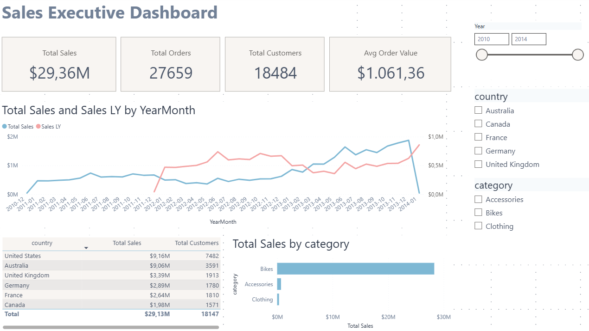
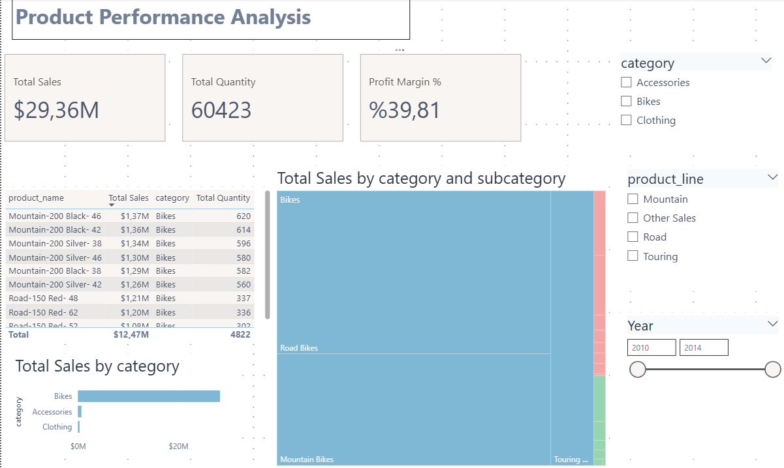
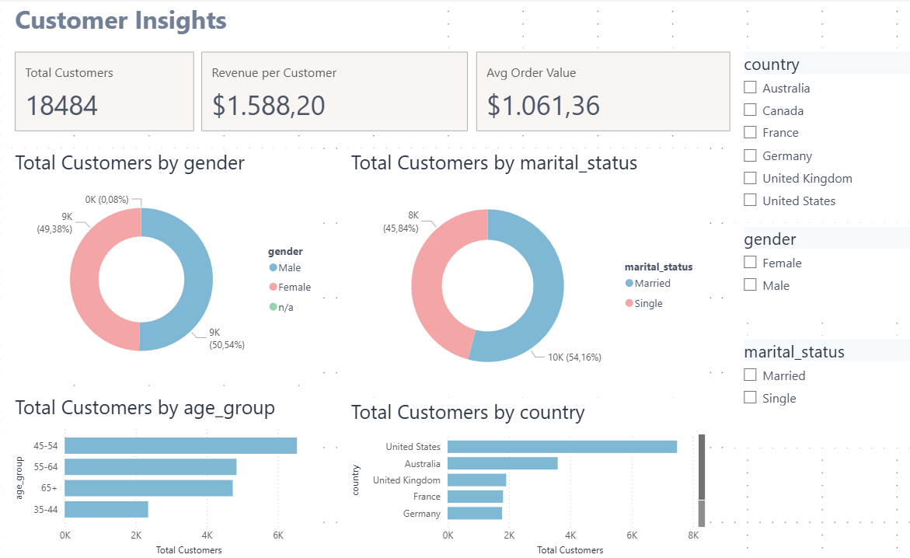
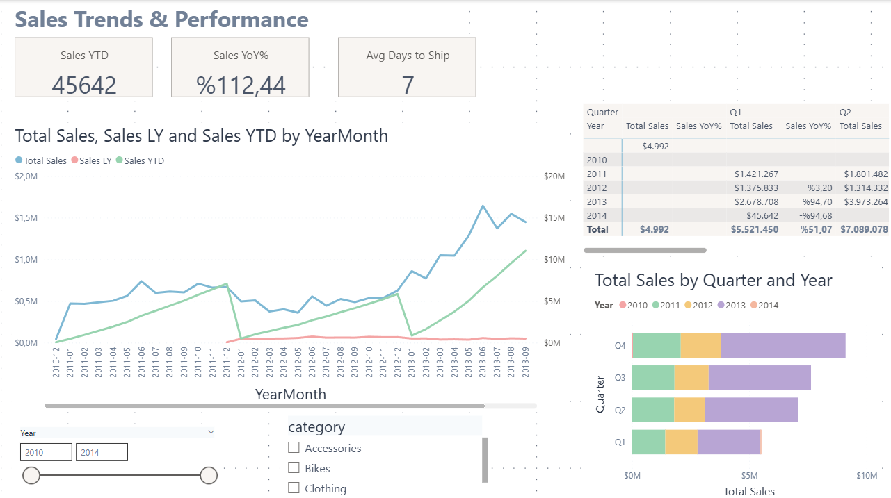

# SQL Server Data Warehouse Implementation

A layered Data Warehouse built with **SQL Server** following the **Medallion Architecture** pattern.

## Architecture

| Layer  | Purpose |
|--------|---------|
| Bronze | Raw data ingestion from CRM & ERP CSV sources via BULK INSERT |
| Silver | Data cleansing, deduplication, normalization and transformation |
| Gold   | Star Schema views (dim_customers, dim_products, fact_sales) for analytics |

## Tech Stack
- SQL Server / T-SQL
- Stored Procedures
- Star Schema (Dimensional Modeling)

## Data Sources
- **CRM:** Customer info, product info, sales details
- **ERP:** Customer demographics, location, product categories

## 📊 Dashboard Screenshots

### Executive Summary

### Product Analysis

### Customer Insights

### Sales Trends & Performance

## How to Run
1. Run `init_database.sql` to create the database and schemas
2. Run `bronze_layer/bronze_layer_table_creation.sql` to create bronze tables
3. Run `silver_layer/ddl_silver.sql` to create silver tables
4. Run `gold_layer/ddl_gold.sql` to create gold views
5. Execute `EXEC bronze.load_bronze` → `EXEC silver.load_silver`
